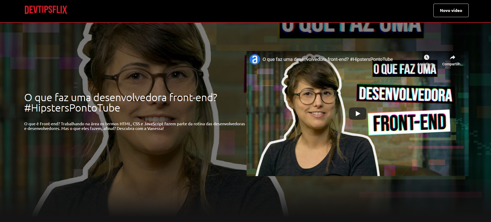

<h3 align="center"> Galeria baseada no layout do netflix que contém vídeos de tutoriais e dicas para devs 👩‍💻👨‍💻! </h3>

 

 

<h2 align="center">Teste o projeto 💻</h2>

-Execute o comando git clone https://github.com/jean-paulo/devtipsflix.git na pasta que deseja baixar o projeto.

-Instale as depêndencias do projeto com o comando yarn, na pasta do projeto, no terminal.

<h2 align="center">Link da aplicação: <a href="https://devtipsflix.vercel.app/">devtipsflix.vercel.app</a>  </h2>
